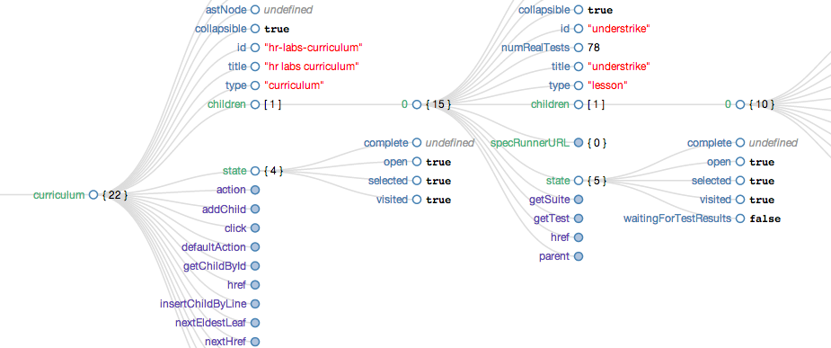

# Periscope

A sea-level view of your angular scope tree--with inline primitive editing.

Properties are sorted and colored by type class:

* objects and arrays (collections)
* undefined, null, string, number, boolean (primitives)
* functions and methods



#### _Caveat emptor_

This is alpha software--rough seas ahead.

# Up Periscope!

_index.html_

```
 <script src="bower_components/d3/d3.js"></script>
 <script src="bower_components/periscope/periscope.js"></script>
 <link rel="stylesheet" href="bower_components/periscope/periscope.css"></script>
```

_app.js_

```
angular.module('myApp', [])

.run(function($rootScope){
  window.periscope($rootScope);
})
```

#### In other words...

Include `periscope.js`, `periscope.css`, and `d3.js` in your app. When you're ready, call `window.periscope($scope)`, where `$scope` is a reference to the scope object that you'd like to visualize and manipulate (probably `$rootScope`, and probably in a `run` block on your app module).
